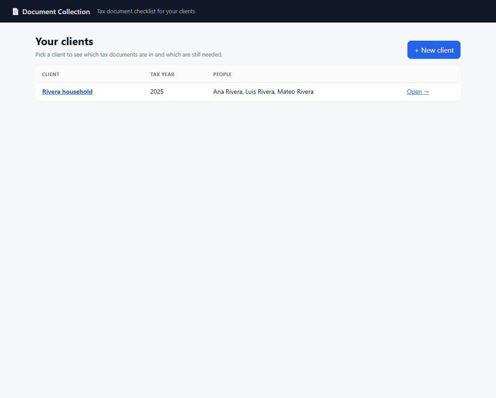
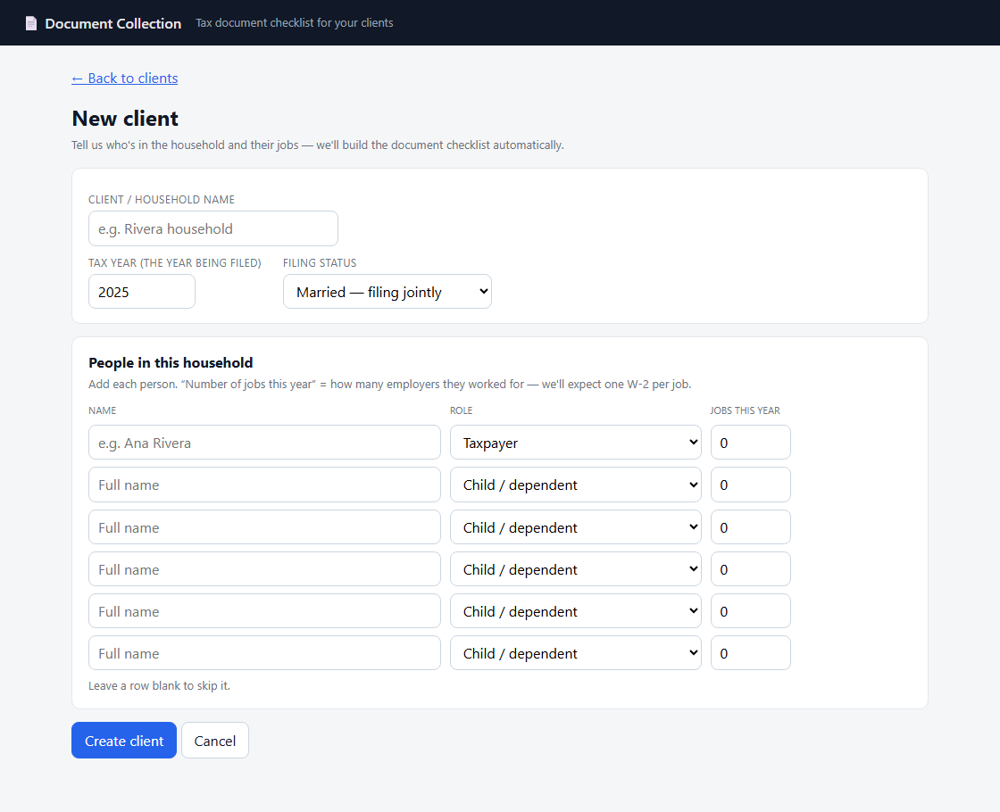
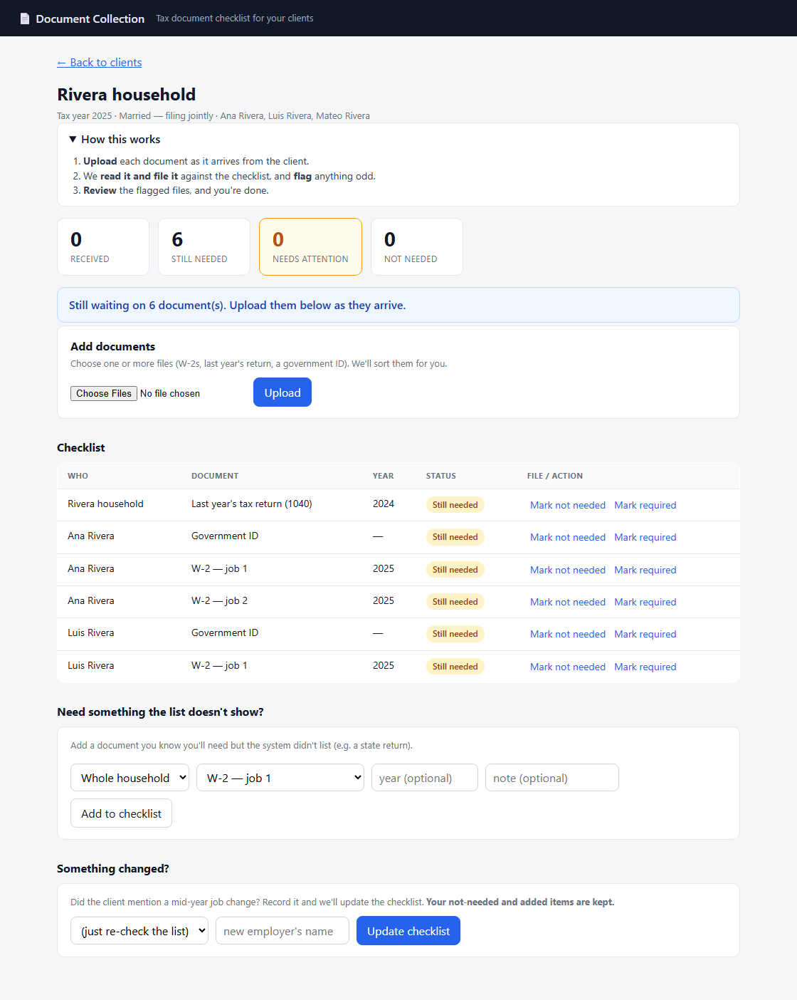
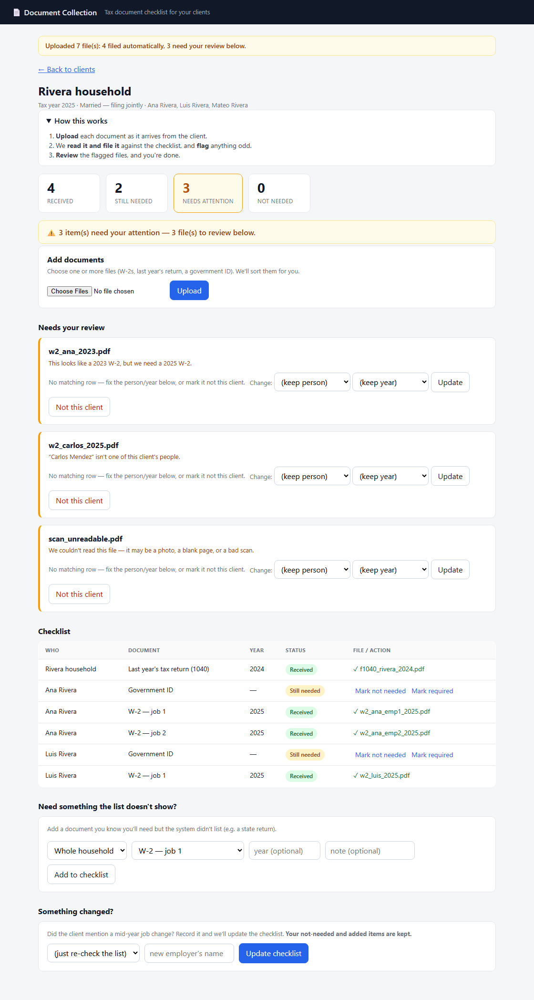

# The Document Collection Problem

A tax accountant can't file a client's return until a **client-specific set of documents** is
in hand. This app answers, for one client at any moment: **what's received, what's still
outstanding, and what needs my attention** — while the required list is *re-derived* as facts
change and documents *arrive noisily* and are *machine-classified*.

The full design rationale lives in **[`docs/`](docs/README.md)** (read `docs/README.md`
first). This file is how to run it, what was decided, and what was left out.

---

## Quick start

```bash
python -m venv venv
venv\Scripts\activate                 # Windows  (source venv/bin/activate on *nix)
pip install -r requirements.txt

python scripts/fetch_samples.py       # download the official IRS templates
python scripts/build_fixtures.py      # generate the test/demo document set
python scripts/seed.py                # create the Rivera household + January checklist

flask --app app run                   # → http://127.0.0.1:5000/client/1
```

Run the tests (no browser needed for the logic):

```bash
pytest -q                             # 39 tests
```

---

## Screen-by-screen walkthrough

*(Screenshots are captured from the running app by `scripts/screenshots.py`.)*

**1. Clients** — the landing page. Open a client or **+ New client**.



**2. New client** — enter the household, its people, and how many jobs each had this year.
The document checklist is built automatically from this.



**3. The client checklist** — everything this client owes, grouped by person, with plain
statuses (Received / Still needed / Not needed).



**4. After uploading** — clean files file themselves; the awkward ones (wrong year, unknown
person, unreadable) land in **Needs your review** with a plain-English reason and safe, guided
actions. Note the **"No matching row"** guard (a file can't be mis-filed onto the wrong row)
and the **"Need something the list doesn't show?"** panel for adding a document manually.



---

## What it does (the four hard parts)

The screen is simple; the machinery under it is where the real work is.

1. **Derivation** — the checklist is *computed* from facts, not typed. Everyone needs the
   prior-year 1040 and a gov ID; each person needs one W-2 per employer they worked for that
   year. `app/domain/derivation.py` is a **pure function** of the facts.
2. **Re-derivation without clobbering the human** *(the crux)* — the list is derived again
   whenever a client discloses something late (e.g. a June job change surfacing in March). By
   then the accountant has waived, removed, and added items. `app/domain/reconciliation.py`
   does a **three-way merge**: it flips the system's `system_required` flag but **never touches
   `human_override`**, and it *deactivates* dropped requirements rather than deleting them.
3. **Noisy classification** — `app/domain/classifier/` is a **content-first `TieredExtractor`**:
   AcroForm form fields → text layer → OCR stub. It reads the *employee name, employer, year,
   wages from the document itself*; the filename is never trusted for a confident match. Low
   confidence / wrong year / unknown person / unreadable all route to review instead of being
   acted on.
4. **Matching** — `app/domain/matching.py` attaches a confident document to the right
   requirement slot (per person, per type, per year, in arrival order) or escalates it to the
   attention queue.

**Requirements** (the derived + human-edited checklist) and **Documents** (files that arrive)
are deliberately separate lifecycles that meet only at matching — that separation is what makes
re-derivation safe. **Effective status is computed, never stored** (`app/domain/status.py`).

## The data is real and reproducible

Blank IRS forms carry no identity, and scavenged "samples" online are unreliable (blank,
tooltip-only, or scanned). So fixtures are **generated** by filling the official IRS AcroForm
templates with synthetic scenario data (`scripts/build_fixtures.py`), plus one real vendor
(ADP) text-layer W-2 that doubles as a wrong-year + unknown-person case, and a rasterized
image for the unreadable case. See [`docs/02`](docs/02-data-and-classifier.md).

## Demo narration (for the walkthrough video)

1. Open `/client/1` — the **January** checklist (Luis has 1 job → 1 W-2).
2. Upload clean W-2s / the 1040 → they **auto-match**. Upload the awkward files
   (`w2_ana_2023`, `w2_carlos_2025`, `scan_unreadable`, the ADP sample) → they land in
   **Needs attention** with the reason and the tool's confidence.
3. **Waive** Luis's gov ID and **add** a requirement — simulating two months of edits.
4. **Re-derive** with Luis's June job change → **exactly one** new W-2 appears; the waiver and
   the added item are **still there**. That's the whole point, on screen.
5. Resolve the queue (accept / reassign / reject); the header counts settle.

---

## Decisions & assumptions (recorded per the brief)

- **Stack:** Flask + SQLAlchemy 2.0 + Jinja2 + SQLite, `pytest`. Domain layer has no Flask
  imports so the logic is testable headless.
- **Gov ID** = one per filing adult (taxpayer + spouse); dependents don't file. Not year-scoped.
- **One 1040** per household, for `tax_year − 1`. **Year validation is doc-type aware**
  (W-2 = `tax_year`, 1040 = `tax_year − 1`) — a subtle correctness point.
- **W-2s are ordinal slots** per person, filled in arrival order; employer identity is optional
  and only annotates a slot.
- **Re-derivation deactivates, never deletes**; `human_override` always wins over the system.
- **Classifier is real** (form-field + text extraction), not a hardcoded stub, but **OCR is not
  a v1 runtime dependency** — image-only input is routed to review as `unreadable`.
- Confidence threshold for auto-match is `0.60`; a human reassignment bypasses the confidence
  gate (they've already reviewed it) but not the year/person/slot gates.

## What I left out (and would do next)

- **No auth / multi-tenant** — single-accountant assumption.
- **No real OCR/ML** — the pluggable `Classifier` interface is ready for a model at tier 3.
- **No background jobs** — ingestion runs synchronously on upload.
- **No employer-identity resolution** — W-2 slots are ordinal; next step is matching a document
  to a specific employer by EIN/name so surplus/duplicate W-2s are detected more precisely.
- **Thin UI** — server-rendered and functional; next step is inline per-document diff of the
  classifier's "why" and an audit-log view (the `event` table already records it).

## Layout

```
app/            Flask factory, models, routes, templates, domain/ (derivation, reconciliation,
                matching, status, classifier/)
scripts/        fetch_samples, build_fixtures, seed
tests/          34 tests mapping 1:1 to the scenarios in docs/05  (+ committed fixtures/)
docs/           the full specification set
```
